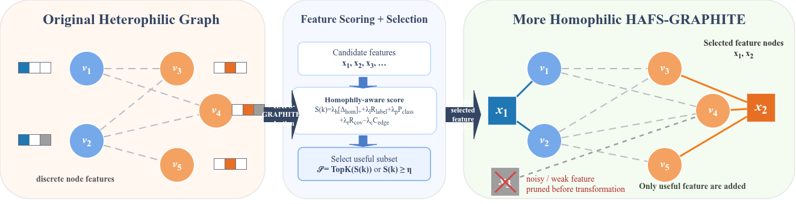
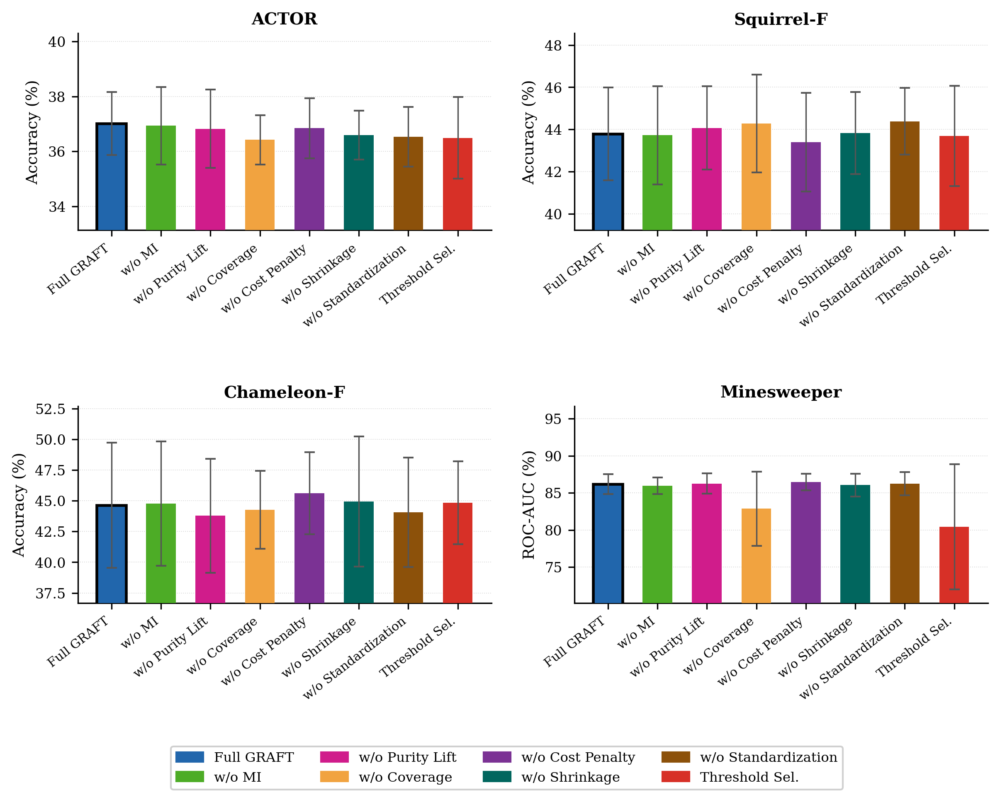
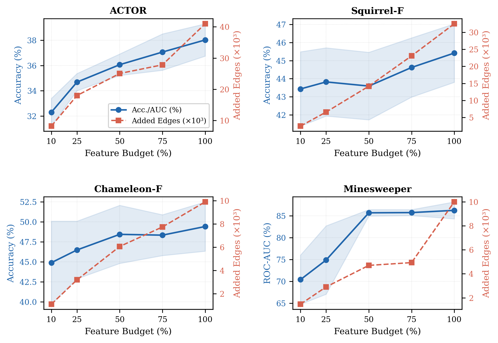

# GRAFT: Graph-Relevance-Aware Feature Transformation for Heterophilic Graph Learning

**Compact feature-node graph transformation for heterophilic node classification**

[](https://www.python.org/)
[](https://pytorch.org/)
[](https://pytorch-geometric.readthedocs.io/)
[](#overview)
[](#method-overview)
[](#license)

> **Paper:** GRAFT: Graph-Relevance-Aware Feature Transformation for Heterophilic Graph Learning  
> **Target venue format:** Neurocomputing / Elsevier-style manuscript  
> **Task:** Semi-supervised node classification on heterophilic and homophilic graph benchmarks  
> **Main idea:** Select only graph-relevant feature nodes before feature-node graph transformation.

---

## Overview

<p align="justify">
Graph neural networks can lose discriminative information on heterophilic graphs because connected nodes often belong to different classes. Feature-node transformation is a useful way to reduce this problem: each discrete feature can be converted into an auxiliary feature node, allowing graph nodes that share that feature to communicate through short two-hop paths. However, converting every active feature into an auxiliary node can introduce noisy shortcuts, redundant feature nodes, unnecessary feature edges, and higher memory or runtime cost.
</p>

<p align="justify">
<b>GRAFT</b> addresses this issue with a relevance-aware graph transformation. Instead of building feature nodes for all active features, it first ranks candidate features using label relevance, above-chance homophily evidence, structural coverage, and an edge-cost penalty. Only the selected feature subset is converted into auxiliary feature nodes. The selected-feature graph is then trained with a feature-node-aware gated GNN backbone.
</p>

<p align="justify">
The repository is organized for paper reproduction, GitHub presentation, result-table regeneration, ablation visualization, and future extension. The README is written as implementation documentation rather than a copied manuscript summary, so it can be safely used on GitHub without duplicating the paper text.
</p>

---

## System Model Figure

<p align="center">
  
</p>

<p align="justify">
The system model shows the full GRAFT workflow. A graph with node features is first analyzed at the feature level. Candidate features are scored, unreliable or expensive features are pruned, and only the selected subset is used to create auxiliary feature nodes. The compact transformed graph then supports message passing through useful feature-induced two-hop paths.
</p>

---

## Why GRAFT?

<p align="justify">
Exhaustive feature-node transformation is simple, but it assumes that every feature is useful for message passing. This assumption is often too strong. Some features are rare, some are weakly related to labels, some connect many classes at once, and some create many additional feature edges with little gain. GRAFT keeps the useful part of feature-node transformation while reducing unnecessary graph expansion.
</p>

**GRAFT is designed to:**

- improve heterophilic graph learning through selected feature-induced two-hop paths;
- reduce auxiliary feature nodes and feature edges compared with all-feature transformation;
- retain above-chance same-label two-hop connectivity when selected features are informative;
- provide a controlled accuracy-efficiency trade-off rather than simply maximizing graph size;
- support reproducible evaluation on Actor, Squirrel-F, Chameleon-F, Minesweeper, Cora, and CiteSeer.

---

## Method Overview

### 1. Selected-Feature Graph Transformation

<p align="justify">
Given a graph <code>G = (V, E, X)</code>, GRAFT selects a subset of discrete features <code>S</code>. For each selected feature, the method creates one auxiliary feature node. A graph node is connected to a selected feature node if that graph node contains the corresponding feature. This produces a compact transformed graph with original graph edges plus selected feature edges.
</p>

```text
Original graph:
  G = (V, E, X)

Selected features:
  S ⊆ X

Selected feature nodes:
  V_S = {x_k : k ∈ S}

Selected feature edges:
  E_S = {(v_i, x_k) : X[v_i, k] = 1 and k ∈ S}

Transformed graph:
  G*_S = (V ∪ V_S, E ∪ E_S, X*_S)
```

<p align="justify">
When <code>S</code> contains all active features, the transformation becomes an exhaustive all-feature construction. When <code>S</code> is smaller, GRAFT obtains a more compact graph while keeping selected feature-induced connectivity.
</p>

---

### 2. Graph-Relevance-Aware Feature Scoring

<p align="justify">
Each candidate feature is scored before graph construction. The score combines complementary criteria so that selected features are not only predictive, but also useful as graph-construction objects.
</p>

| Score component | Purpose |
|---|---|
| Normalized mutual information | Measures how much feature presence reduces label uncertainty. |
| Purity lift above chance | Rewards features whose labeled members share labels more often than random class collision. |
| Coverage | Encourages features that cover enough nodes to create meaningful shortcuts. |
| Edge-cost penalty | Penalizes features that create too many feature edges. |
| Low-support shrinkage | Reduces overconfidence for features with few labeled examples. |
| Standardization | Places all score terms on comparable scales before combination. |

Compact score form:

```text
score(k) = λ_MI · z(β · R_MI(k))
         + λ_h  · z(β · G_hom(k))
         + λ_r  · z(R_cov(k))
         - λ_c  · z(C_edge(k))
```

Selection can be done by top-budget ranking or by thresholding:

```text
Top-K:       S = top ranked features by score(k)
Threshold:   S = {k : score(k) ≥ η}
```

---

### 3. Feature-Node-Aware Gated Backbone

<p align="justify">
After graph transformation, the compact graph is passed to a gated GNN backbone. The model distinguishes original graph edges, selected feature edges, and self-loops through edge weights and gating. This lets the neural model use feature-induced paths while avoiding a fully exhaustive auxiliary graph.
</p>

Implementation objects include:

```text
GraphiteGatedLayer
GraphiteGatedNet
build_graphite()
train_one_run()
evaluate_metric()
```

---

## Repository Layout

Use the following GitHub structure:

```text
GRAFT/
├── README.md
│
├── figs/
│   └── GRAFT.png                         <- system model / method overview figure
│
├── graphs/
│   ├── fig_ablation.pdf                  <- publication-quality ablation figure
│   ├── fig_ablation.png                  <- GitHub-rendered ablation figure
│   ├── fig_budget_sensitivity.pdf        <- publication-quality budget sensitivity figure
│   └── fig_budget_sensitivity.png        <- GitHub-rendered budget sensitivity figure
│
├── code/
│   └── hafs_graphite.py                  <- main GRAFT experiment script
│
├── data/
│   ├── dataset_stats.csv                 <- dataset statistics
│   ├── main_results.csv                  <- controlled main results
│   ├── main_results_with_paper_reference.csv
│   ├── compactness_results.csv           <- feature-node / feature-edge reduction results
│   ├── homophily_results.csv             <- homophily and two-hop connectivity results
│   ├── selected_hparams.csv              <- selected budgets and backbone hyperparameters
│   ├── selection_baseline_results.csv    <- random/frequency/MI selection baselines
│   ├── ablation_results.csv              <- score-component ablation results
│   ├── sensitivity_results.csv           <- feature-budget sensitivity results
│   └── raw_results.csv                   <- per-run raw scores, time, and memory
│
├── dataset/
│   └── graphite_data/                    <- local raw benchmark files
│       ├── Actor/raw/
│       ├── Planetoid/Cora/raw/
│       ├── Planetoid/CiteSeer/raw/
│       ├── platonov_filtered/
│       │   ├── squirrel_filtered.npz
│       │   └── chameleon_filtered.npz
│       └── Heterophilous/raw/
│           └── minesweeper.npz
│
└── LICENSE                               <- add license before public release
```

> **Path note:** If the main script is stored inside `code/`, make sure the script resolves the repository root rather than the `code/` directory. A safe setting is:
>
> ```python
> PROJECT_DIR = Path(__file__).resolve().parents[1]
> DATA_ROOT_PATH = PROJECT_DIR / "dataset" / "graphite_data"
> OUT_DIR_PATH = PROJECT_DIR / "data"
> ```
>
> If your script still uses `Path(__file__).resolve().parent`, it will look for `data/` inside the `code/` folder. Update the path or create a symlink before running.

---

## Graphs and Visual Results

### Ablation Study

<p align="center">
  
</p>

<p align="justify">
The ablation figure compares score-component variants on heterophilic benchmarks. It illustrates that no single term dominates across all datasets; different graph-feature distributions benefit from different combinations of relevance, purity, coverage, and cost control. The full GRAFT score is used as the main reference.
</p>

---

### Feature-Budget Sensitivity

<p align="center">
  
</p>

<p align="justify">
The budget sensitivity figure shows how performance and feature-edge count change as the selected feature budget increases. Small budgets may remove useful feature nodes, while larger budgets recover accuracy with more edges and higher computation. The preferred setting is the validation-selected budget that balances accuracy and compactness.
</p>

---

## Datasets

GRAFT is evaluated on six node-classification benchmarks:

| Dataset | Metric | Split protocol in code | Notes |
|---|---|---|---|
| Actor | Accuracy | Official fixed splits | Heterophilic benchmark from the film/actor graph setting. |
| Squirrel-F | Accuracy | Official filtered fixed splits | Filtered heterophilic graph. |
| Chameleon-F | Accuracy | Official filtered fixed splits | Filtered heterophilic graph. |
| Minesweeper | ROC-AUC | Official fixed splits when available | Binary heterophilic benchmark; AUC is used. |
| Cora | Accuracy | Dense random 60/20/20 split | Homophilic citation graph used for controlled comparison. |
| CiteSeer | Accuracy | Dense random 60/20/20 split | Homophilic citation graph used for controlled comparison. |

<p align="justify">
The implementation is configured for local data by default. This is recommended for reproducibility because it avoids silent changes caused by remote dataset updates or download failures.
</p>

---

## Installation

### 1. Create a Python environment

```bash
conda create -n graft python=3.10 -y
conda activate graft
```

### 2. Install core packages

```bash
pip install -U pip setuptools wheel
pip install numpy pandas scipy scikit-learn matplotlib
pip install torch torchvision torchaudio
pip install torch_geometric
```

### 3. Optional CUDA-specific PyTorch/PyG install

For GPU machines, install PyTorch and PyTorch Geometric according to your CUDA version:

```bash
python -c "import torch; print(torch.__version__, torch.version.cuda)"
```

Then follow the official PyTorch and PyG installation commands for your driver and CUDA runtime.

---

## Quick Start

### 1. Clone the repository

```bash
git clone https://github.com/<your-user-or-lab>/GRAFT.git
cd GRAFT
```

### 2. Prepare the folder structure

```bash
mkdir -p code data dataset/graphite_data figs graphs
```

Place files as follows:

```text
code/hafs_graphite.py
figs/GRAFT.png
graphs/fig_ablation.png
graphs/fig_ablation.pdf
graphs/fig_budget_sensitivity.png
graphs/fig_budget_sensitivity.pdf
```

Place raw benchmark files under:

```text
dataset/graphite_data/
```

### 3. Run the main experiment

```bash
python code/hafs_graphite.py
```

### 4. Check generated outputs

When the script is configured with the repository-root path, outputs are saved to:

```text
data/
```

Expected CSV outputs include:

```text
raw_results.csv
main_results.csv
main_results_with_paper_reference.csv
homophily_results.csv
compactness_results.csv
selected_hparams.csv
dataset_stats.csv
selection_baseline_results.csv
ablation_results.csv
sensitivity_results.csv
```

---

## Code Tour

```text
code/hafs_graphite.py
├── 0. Optional dependency setup
│   └── checks/imports PyTorch and PyTorch Geometric
│
├── 1. Imports
│   └── NumPy, Pandas, Matplotlib, PyTorch, PyG, sklearn metrics
│
├── 2. Configuration
│   ├── project/data/output paths
│   ├── dataset list and metric settings
│   ├── full-run vs fast-debug mode
│   ├── backbone hyperparameter grid
│   └── GRAFT/HAFS scoring weights and feature budgets
│
├── 3. Utility functions
│   ├── random seed control
│   ├── split-mask construction
│   ├── official split loading
│   ├── GPU memory tracking
│   └── undirected-edge cleanup
│
├── 4. Dataset loading
│   ├── Actor through PyG
│   ├── Cora and CiteSeer through Planetoid
│   ├── Squirrel-F and Chameleon-F from filtered .npz files
│   └── Minesweeper from local heterophilous benchmark file
│
├── 5. Feature preparation
│   ├── binarize_features()
│   └── prepare_features()
│
├── 6. GRAFT scoring
│   ├── ScoreConfig
│   ├── hafs_components()
│   ├── hafs_scores()
│   ├── select_by_scores()
│   └── select_features()
│
├── 7. Selected-feature graph construction
│   ├── build_graphite_graph()
│   └── edge_weight_from()
│
├── 8. Feature-node-aware gated backbone
│   ├── GraphiteGatedLayer
│   ├── GraphiteGatedNet
│   └── build_graphite()
│
├── 9. Training and evaluation
│   ├── evaluate_metric()
│   ├── train_one_run()
│   ├── train_graphite_on()
│   ├── sweep_backbone()
│   └── run_selected_eval()
│
├── 10. Graph analysis metrics
│   ├── feature_homophily()
│   ├── adjusted_homophily()
│   ├── chance_collision_level()
│   └── two_hop_same_label_rate()
│
└── 11. Main experiment and output writing
    ├── controlled exhaustive-transformation run
    ├── GRAFT budget and shrinkage sweep
    ├── matched-budget selection baselines
    ├── ablation and sensitivity experiments
    ├── CSV export
    └── figure export
```

> **Naming note:** Some internal code variables use `HAFS` because the feature-selection scorer was originally named Homophily-Aware Feature Selection. In the paper and repository documentation, this module is presented as part of the complete GRAFT framework.

---

## Main Controlled Results

<p align="justify">
The main controlled comparison evaluates GRAFT against an exhaustive all-feature transformation under the same implementation and training pipeline. Accuracy is reported for Actor, Squirrel-F, Chameleon-F, Cora, and CiteSeer. ROC-AUC is reported for Minesweeper. The key finding is that GRAFT usually keeps competitive performance while sharply reducing the number of added feature nodes and feature edges.
</p>

| Dataset | Method | Acc./AUC (%) | Δ | Budget | Added nodes | Node reduction | Added edges | Edge reduction | Time / Memory |
|---|---|---:|---:|---:|---:|---:|---:|---:|---:|
| Actor | Exhaustive transformation | 37.67 ± 0.77 | — | 100% | 932 | — | 40,977 | — | 139.59s / 10363.8MB |
| Actor | GRAFT | 37.15 ± 1.51 | −0.52 | 75% | 699 | 25.0% | 27,832 | 32.1% | 86.67s / 8602.9MB |
| Squirrel-F | Exhaustive transformation | 45.35 ± 1.71 | — | 100% | 1,593 | — | 32,481 | — | 91.84s / 11275.9MB |
| Squirrel-F | GRAFT | 43.71 ± 2.32 | −1.64 | 10% | 159 | 90.0% | 2,451 | 92.5% | 61.38s / 7102.7MB |
| Chameleon-F | Exhaustive transformation | 48.93 ± 2.58 | — | 100% | 1,980 | — | 9,903 | — | 28.18s / 3061.8MB |
| Chameleon-F | GRAFT | 44.72 ± 5.27 | −4.21 | 10% | 198 | 90.0% | 1,099 | 88.9% | 15.03s / 1648.4MB |
| Minesweeper | Exhaustive transformation | 87.33 ± 1.30 | — | 100% | 7 | — | 10,000 | — | 138.58s / 8100.1MB |
| Minesweeper | GRAFT | 86.22 ± 1.50 | −1.11 | 75% | 5 | 28.6% | 4,935 | 50.6% | 88.11s / 7429.0MB |
| Cora | Exhaustive transformation | 85.03 ± 1.74 | — | 100% | 1,432 | — | 49,216 | — | 75.02s / 7982.6MB |
| Cora | GRAFT | 85.45 ± 1.59 | +0.42 | 50% | 716 | 50.0% | 27,622 | 43.9% | 43.70s / 5034.5MB |
| CiteSeer | Exhaustive transformation | 72.79 ± 3.98 | — | 100% | 3,703 | — | 105,165 | — | 127.73s / 15830.8MB |
| CiteSeer | GRAFT | 74.19 ± 2.33 | +1.40 | 10% | 370 | 90.0% | 8,626 | 91.8% | 22.78s / 2572.0MB |

<p align="justify">
GRAFT improves over the controlled exhaustive run on Cora and CiteSeer, stays close on Actor and Minesweeper, and trades some accuracy for large compactness gains on Squirrel-F and Chameleon-F. This supports the paper claim that GRAFT is mainly a compact relevance-aware transformation, not a universal accuracy-maximization trick.
</p>

---

## Reproducibility Settings

Important defaults in the main script:

```text
FAST_MODE = False
EPOCHS = 1000
RUNS = 10
HIDDEN = 512
LAYERS = 8
DROPOUT = 0.2
LR = 3e-5
WEIGHT_DECAY = 0.0
SELECTION_MODE = topk
HAFS_BUDGETS = [0.10, 0.25, 0.50, 0.75]
SENS_BUDGETS = [0.10, 0.25, 0.50, 0.75, 1.00]
LOCAL_DATA_ONLY = True
```

For a quick smoke test, you may temporarily set:

```python
FAST_MODE = True
```

<p align="justify">
Fast mode is only for debugging path issues, installation, and GPU availability. Use full mode for paper-aligned numbers.
</p>

---

## Output Files

### Result CSV files

| File | Description |
|---|---|
| `raw_results.csv` | Per-run test score, validation score, runtime, memory, budget, and added graph size. |
| `main_results.csv` | Mean and standard deviation of main controlled results. |
| `main_results_with_paper_reference.csv` | Main results plus published all-feature reference values for context. |
| `compactness_results.csv` | Added nodes, added edges, node reduction, and edge reduction. |
| `homophily_results.csv` | Feature homophily, adjusted homophily, chance level, and selected two-hop same-label rates. |
| `selected_hparams.csv` | Validation-selected budgets, shrinkage values, and backbone hyperparameters. |
| `dataset_stats.csv` | Dataset node, edge, feature, active-feature, and class statistics. |
| `selection_baseline_results.csv` | Matched-budget comparison with random, frequency, and MI-only selection. |
| `ablation_results.csv` | Score-component ablation results. |
| `sensitivity_results.csv` | Budget sensitivity results across selected feature ratios. |

### Figure files

| File | Use |
|---|---|
| `figs/GRAFT.png` | README and paper system-model figure. |
| `graphs/fig_ablation.png` | GitHub display version of ablation study. |
| `graphs/fig_ablation.pdf` | Paper-ready vector/PDF version of ablation study. |
| `graphs/fig_budget_sensitivity.png` | GitHub display version of budget sensitivity. |
| `graphs/fig_budget_sensitivity.pdf` | Paper-ready vector/PDF version of budget sensitivity. |

---

## Interpreting the Results

<p align="justify">
GRAFT should be interpreted as a compact graph-transformation method. Its goal is not to create the largest possible transformed graph, nor to guarantee that selection always improves accuracy. Instead, it reduces auxiliary graph size by removing weak, noisy, or costly features before graph construction. In the reported controlled experiments, GRAFT reduces auxiliary feature nodes by 25–90% and feature edges by 32.1–92.5%, while maintaining competitive accuracy across several datasets.
</p>

<p align="justify">
The accuracy-efficiency balance is dataset dependent. If a dataset has many redundant or weakly useful features, aggressive selection can be beneficial. If many features jointly contribute to classification, a very small selected budget may hurt performance. This is why the code includes budget sensitivity and ablation analyses.
</p>

---

## Troubleshooting

### Missing local dataset files

The script uses local data by default. If you see a missing-file error, check that the following folder exists:

```text
dataset/graphite_data/
```

If the script expects a different location, update:

```python
DATA_ROOT_PATH = PROJECT_DIR / "dataset" / "graphite_data"
```

---

### Output appears inside `code/data/`

If `data/` is created inside the `code/` directory, update the root path:

```python
PROJECT_DIR = Path(__file__).resolve().parents[1]
OUT_DIR_PATH = PROJECT_DIR / "data"
```

---

### `ModuleNotFoundError: torch_geometric`

Install PyTorch Geometric:

```bash
pip install torch_geometric
```

For CUDA-specific wheels, use the official installation command from the PyG website.

---

### CUDA memory errors

Try one or more of the following:

- set `FAST_MODE = True` for debugging;
- reduce `HIDDEN` from `512` to `256`;
- reduce `LAYERS` from `8` to `4`;
- reduce `RUNS` during pilot experiments;
- run one dataset at a time by editing `DATASETS`.

---

## Citation

If you use this code or reproduce the results, please cite the paper:

```bibtex
@article{graft2026,
  title   = {GRAFT: Graph-Relevance-Aware Feature Transformation for Heterophilic Graph Learning},
  author  = {First Author and Second Author and Third Author},
  journal = {Neurocomputing},
  year    = {2026},
  note    = {Manuscript under review}
}
```

Update the author names, venue status, DOI, and publication year after acceptance.

---
